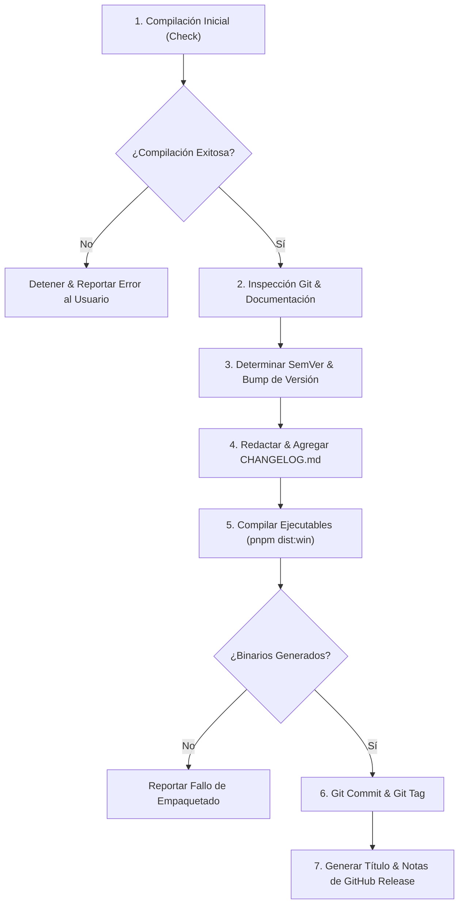

# MicroDB Studio - Protocolo del Agente de Release

Este skill define el procedimiento autónomo estándar para preparar, compilar y publicar una nueva versión de **MicroDB Studio** cuando se han implementado mejoras, correcciones o nuevas funcionalidades.

---

## 🛡️ Reglas y Filosofía de Release

1. **Cero Tolerancia a Fallos de Compilación:** Nunca modificar versiones ni crear tags si la aplicación no compila limpiamente en frío.
2. **Sincronización Total de Archivos:** La versión debe actualizarse coordinadamente en:
   - `package.json` (`"version": "X.Y.Z"`)
   - `README.md` (nombres de ejecutables `MicroDB Studio Setup X.Y.Z.exe` y `MicroDB Studio X.Y.Z.exe`)
   - `CHANGELOG.md` (nueva cabecera `## [X.Y.Z] - YYYY-MM-DD`)
3. **Reproducibilidad:** Los ejecutables generados en `dist-electron/` deben coincidir exactamente con el tag de Git y el commit de la versión.
4. **Formato Listo para GitHub:** Al finalizar, el agente debe entregar al usuario el título y el cuerpo Markdown completos para la sección de Releases de GitHub.

---

## 📋 Flujo de Trabajo en 7 Pasos



---

### Paso 1: Verificación de Compilación Inicial

Antes de alterar cualquier archivo de versión, ejecuta:
```bash
node scripts/release.mjs check
```
*(O de forma directa: `pnpm.cmd build`)*

- Si falla Vite o TypeScript (exit code !== 0):
  - **DETENER inmediatamente el release.**
  - Mostrar al usuario los archivos y líneas con errores.
  - Ofrecer corregir los fallos antes de proceder.

---

### Paso 2: Análisis de Cambios en Git y Documentación

1. Obtén el estado actual y los commits recientes desde el último tag:
   ```bash
   node scripts/release.mjs status
   ```
2. Analiza los cambios en el código (`git diff` y `git status`):
   - ¿Se agregaron nuevos componentes o vistas?
   - ¿Se modificó el motor de compactación (Vacuum), el bridge SQLite o la sincronización SD?
   - ¿Cambió la interfaz de usuario?
3. Verifica si es necesario actualizar la documentación técnica:
   - **`DOCUMENTACION_SOFTWARE.md`**: Actualizar si se alteraron flujos de arquitectura, soporte multi-base de datos, endpoints o servicios del servidor.
   - **`GUIA_ARDUINO_MICRODB.md`**: Actualizar si hubo modificaciones en compatibilidad de registros binarios `.tbl`, encabezados o índices `.idx`.

---

### Paso 3: Determinación de SemVer e Incremento de Versión

Determina el tipo de incremento siguiendo **Semantic Versioning**:
- **Patch (`x.y.Z`)**: Correcciones de bugs, mejoras cosméticas, optimizaciones internas retrocompatibles.
- **Minor (`x.Y.0`)**: Nuevas funcionalidades de usuario, soporte para nuevos formatos, nuevos accesos directos.
- **Major (`X.0.0`)**: Cambios disruptivos en el formato binario de almacenamiento o incompatibilidad total de API.

Ejecuta el incremento automático:
```bash
node scripts/release.mjs bump <patch|minor|major|x.y.z>
```
Este comando actualiza automáticamente:
1. `"version"` en `package.json`.
2. Las referencias de instaladores en `README.md`.

---

### Paso 4: Actualización de `CHANGELOG.md`

Edita `CHANGELOG.md` insertando la nueva versión justo arriba de la sección anterior, siguiendo la convención [Keep a Changelog](https://keepachangelog.com/es-ES/1.0.0/):

```markdown
## [X.Y.Z] - YYYY-MM-DD

### 🚀 Añadido
- **Nombre de la característica:** Descripción clara de la nueva funcionalidad.

### 🔧 Mejoras
- Descripción de optimizaciones de rendimiento, sincronización o UI.

### 🐛 Correcciones
- Descripción de errores solucionados.

---
```

---

### Paso 5: Compilación y Empaquetado de Aplicación

Ejecuta el empaquetado para Windows:
```bash
node scripts/release.mjs dist
```
*(O de forma directa: `pnpm.cmd dist:win`)*

Verifica que en `dist-electron/` se hayan generado:
- `MicroDB Studio Setup X.Y.Z.exe` (Instalador NSIS con accesos directos).
- `MicroDB Studio X.Y.Z.exe` (Versión Portable autónoma).
- `latest.yml`

El script mostrará automáticamente el tamaño de los ejecutables en megabytes.

---

### Paso 6: Git Commit y Creación del Git Tag

Ejecuta la creación del commit y tag anotado:
```bash
node scripts/release.mjs tag <X.Y.Z> "<Título o Resumen de la Versión>"
```
O manualmente:
```bash
git add package.json README.md CHANGELOG.md DOCUMENTACION_SOFTWARE.md
git commit -m "chore(release): vX.Y.Z - <Resumen de la Versión>"
git tag -a vX.Y.Z -m "Release vX.Y.Z: <Resumen de la Versión>"
```

---

### Paso 7: Generar Título y Descripción para GitHub Releases

Ejecuta:
```bash
node scripts/release.mjs notes <X.Y.Z> "<Título del Release>"
```

Proporciona al usuario el bloque Markdown listo para copiar y pegar en la interfaz web de GitHub:
- **Título del Release sugerido:** `MicroDB Studio vX.Y.Z - <Título descriptivo>`
- **Tag:** `vX.Y.Z`
- **Target:** `main`
- **Cuerpo del Release (Markdown):** Formato limpio con resumen, novedades, tabla de binarios `.exe` y compatibilidad.
- **Comando final para sincronizar:**
  ```bash
  git push origin main --tags
  ```
