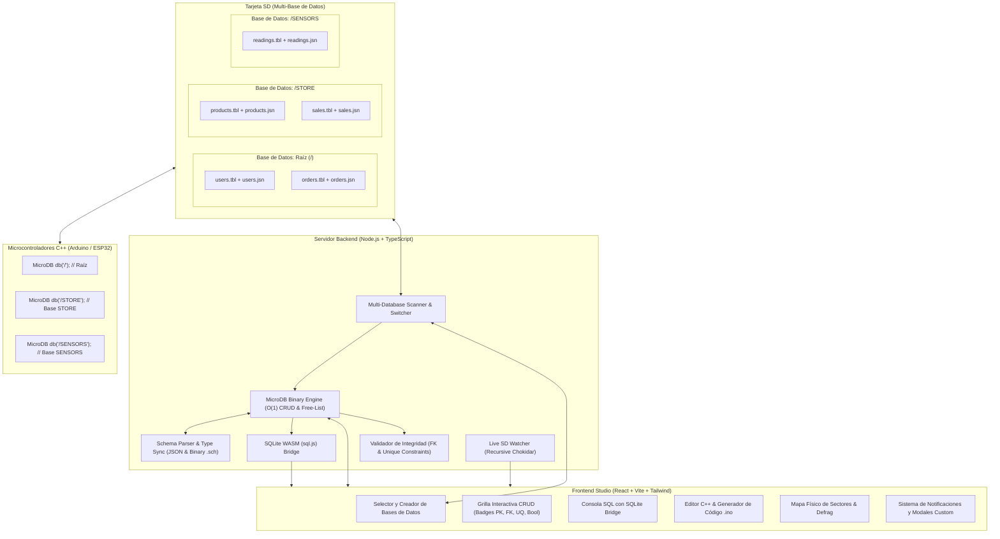

# MicroDB Studio - Documentación Técnica y Manual de Usuario

**MicroDB Studio** es una suite de escritorio de alto rendimiento diseñada específicamente para inspeccionar, administrar, consultar mediante SQL, exportar y sincronizar en tiempo real bases de datos embebidas binarias generadas por la librería C++ **`MicroDB`** (utilizada en Arduino, ESP32, STM32, Teensy y Raspberry Pi Pico).

---

## 1. Arquitectura del Software y Soporte Multi-Base de Datos

Una sola tarjeta SD puede contener **múltiples bases de datos independientes**, cada una aislada en su propia carpeta o en la raíz de la unidad (ej. `E:\`, `E:\STORE\`, `E:\SENSORS\`, `E:\TELEMETRY\`).



---

## 2. Compatibilidad 100% con Arduino C++ `MicroDB`

Tanto *MicroDB Studio* como la librería Arduino C++ `MicroDB` comparten exactamente la misma especificación binaria en disco.

### Matriz de Tipos de Datos y Mapeo:

| Tipo MicroDB Studio | Tipo Arduino C++ | Tamaño (Bytes) | Type ID Arduino | Descripción |
| :--- | :--- | :--- | :--- | :--- |
| **`bool`** | `bool` | 1 | `0` | Booleano (`true` / `false` o `1` / `0`) |
| **`int8`** | `int8_t` / `char` | 1 | `1` | Entero con signo 8 bits |
| **`uint8`** | `uint8_t` / `byte` | 1 | `2` | Entero sin signo 8 bits |
| **`int16`** | `int16_t` / `short` | 2 | `3` | Entero con signo 16 bits |
| **`uint16`** | `uint16_t` / `unsigned short` | 2 | `4` | Entero sin signo 16 bits |
| **`int32`** | `int32_t` / `long` | 4 | `5` | Entero con signo 32 bits |
| **`uint32`** | `uint32_t` / `unsigned long` | 4 | `6` | Entero sin signo 32 bits (Claves PK/FK) |
| **`int64`** | `int64_t` / `long long` | 8 | - | Entero con signo 64 bits |
| **`uint64`** | `uint64_t` / `unsigned long long` | 8 | - | Entero sin signo 64 bits |
| **`float`** | `float` | 4 | `7` | Coma flotante IEEE 754 simple precisión |
| **`double`** | `double` | 8 | `8` | Coma flotante IEEE 754 doble precisión |
| **`char[N]` / `string`** | `char[N]` | N | `9` | Cadena fija terminada en nulo |
| **`blob`** | `uint8_t[N]` | N | `10` | Datos binarios arbitrarios |
| **`json`** | `char[N]` | N | `11` | Documento JSON inline |
| **`media_path`** | `char[N]` | N | `12` | Ruta relativa a imágenes/audio en la SD |

---

## 3. Especificación de Archivos en Disco

Para cada tabla creada en una base de datos (directorio), se generan y sincronizan los siguientes archivos:

1. **`[tabla].tbl` (Datos Binarios MTB1):**
   - **TableHeader (64 bytes):** Magic `0x4D544231` ("MTB1"), versión, `recordSize`, `totalSlots`, `activeRecords`, `deletedRecords`, puntero `firstFreeSlot` (cabeza de la Free-List), y `nextAutoId`.
   - **SlotHeader (9 bytes por registro):** `status` (1 byte: `0x01` Activo, `0x00` Borrado), `recordId` (4 bytes uint32), `nextFreeSlot` (4 bytes uint32).
   - **Payload:** Bloque de bytes del struct C++.
2. **`[tabla].idx` (Índice Secundario O(log N)):**
   - Árbol/lista ordenada de entradas indexadas por hash con complejidad de búsqueda $O(\log N)$.
3. **`[tabla].jsn` y `[tabla].schema.json` (Catálogo de Esquema):**
   - Formato JSON estándar de Arduino y Studio con metadata de columnas, tipos, offsets, tamaños y restricciones (`isPrimaryKey`, `isUnique`, `isForeignKey`, `references`).
4. **`[tabla].sch` (Esquema Binario):**
   - Esquema en formato binario compacto (21 bytes por columna) para microcontroladores con recursos extremadamente reducidos de RAM.

---

## 4. Manual de Operación y Flujo de Trabajo

### Flujo 1: Crear un Proyecto desde MicroDB Studio y llevarlo a Arduino

1. **Seleccionar o Crear Base de Datos:**
   - Abre MicroDB Studio y haz clic en **"Seleccionar SD o Carpeta..."**.
   - Haz clic en **"+ Nueva BD"** en la barra lateral e introduce el nombre (ej. `TIENDA`).
2. **Diseñar las Tablas y Relaciones:**
   - Haz clic en **"+ Nueva Tabla"**.
   - Crea la tabla `users` con campos: `email` (string[32], Único), `is_active` (bool), `balance` (float).
   - Crea la tabla `orders` con campos: `user_id` (uint32, Clave Foránea $\rightarrow$ `users.id`), `amount` (float), `shipped` (bool).
3. **Generar Código Arduino (.ino) en 1 Clic:**
   - Ve a la pestaña **"C++ Structs & Esquemas"**.
   - Haz clic en el botón **"Código Arduino (.ino)"**.
   - Copia el código autogenerado que incluye las estructuras `struct`, inicialización de `SD.h`, `MicroDB db("/TIENDA");` y ejemplos de lectura/escritura.
4. **Cargar en la SD y Ejecutar en Arduino:**
   - Coloca la SD en tu microcontrolador.
   - ¡El código Arduino leerá e insertará datos respetando exactamente el catálogo y las restricciones creadas!

---

### Flujo 2: Administrar y Consultar Datos Creados desde Arduino

1. **Inserción / Edición:**
   - Haz clic en **"Insertar Registro"**.
   - Para campos booleanos, usa el interruptor interactivo (`true`/`false`).
   - Para campos foráneos (FK), el selector desplegable te mostrará las opciones disponibles en la tabla padre (ej. `[ID: 1] - admin@empresa.com`).
2. **Borrado Seguro O(1):**
   - Al eliminar un registro, se marca con Tombstone ($O(1)$) y se encola en la Free-List. Las inserciones posteriores reciclan automáticamente estos slots sin fragmentar la memoria flash.
3. **Consultas SQL y DBeaver:**
   - Usa la **Consola SQL** integrada para consultas complejas (`JOIN`, `GROUP BY`, `ORDER BY`).
   - Usa el botón **"Puente DBeaver"** para inspeccionar la base de datos en tiempo real desde DBeaver conectándote al archivo `microdb_live.sqlite`.
4. **Desfragmentación / Vacuum:**
   - Si la fragmentación supera el 20%, usa la pestaña **"Mapa de Sectores & Salud"** para compactar la tabla físicamente y liberar espacio contiguo en la SD.

---

## 5. Ejemplo Completo de Código Arduino C++

```cpp
#include <SPI.h>
#include <SD.h>
#include "MicroDB.h"

// Definición de estructuras binarias sincronizadas con MicroDB Studio
struct User {
    char email[32];
    bool is_active;
    float balance;
};

struct Order {
    uint32_t user_id; // Clave foránea que referencia a User
    float amount;
    bool shipped;
};

// Base de datos en subcarpeta /TIENDA de la tarjeta SD
MicroDB db("/TIENDA");

void setup() {
    Serial.begin(115200);
    while (!Serial);

    if (!SD.begin(4)) {
        Serial.println("Error iniciando tarjeta SD!");
        return;
    }

    db.begin();

    // Abrir tablas con verificación automática de esquemas
    auto usersTable = db.openTable<User>("users");
    auto ordersTable = db.openTable<Order>("orders");

    // Insertar un usuario
    User newUser = {"cliente@empresa.com", true, 250.75f};
    uint32_t userId = usersTable.insert(newUser);
    Serial.print("Usuario registrado con ID: ");
    Serial.println(userId);

    // Insertar una orden referenciando al usuario
    Order newOrder = {userId, 129.99f, false};
    uint32_t orderId = ordersTable.insert(newOrder);
    Serial.print("Orden registrada con ID: ");
    Serial.println(orderId);
}

void loop() {
    // Lecturas periódicas o procesamiento en tiempo real
}
```
