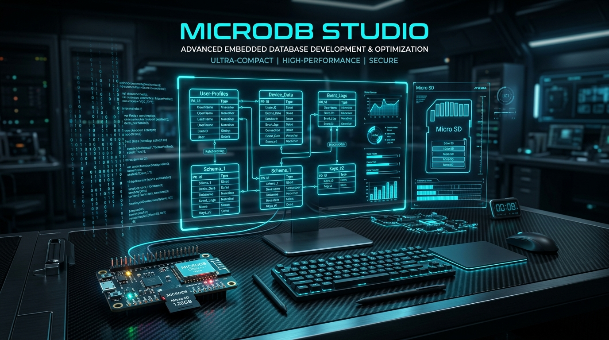

# 🗄️ MicroDB Studio

<div align="center">
  

  <br />

  [](https://www.electronjs.org/)
  [](https://reactjs.org/)
  [](https://www.typescriptlang.org/)
  [](https://tailwindcss.com/)
  [](LICENSE)

  <p align="center">
    <strong>Suite de escritorio visual, moderna y de alto rendimiento para gestionar, monitorear y consultar bases de datos binarias embebidas en tarjetas SD (Arduino / ESP32 / STM32 / RP2040) con MicroDB y compatibilidad con DBeaver.</strong>
  </p>
</div>

---

## 🚀 Inicio Rápido & Distribución

### 🖥️ 1. Ejecutables para Windows (Releases)

MicroDB Studio se distribuye como aplicación nativa de escritorio para Windows:
- **Instalador NSIS:** `MicroDB Studio Setup 1.1.0.exe` (crea accesos directos y asistente de instalación).
- **Versión Portable:** `MicroDB Studio 1.1.0.exe` (ejecutable autónomo *single-file*, no requiere instalación ni permisos de administrador).

### 🛠️ 2. Ejecutar desde Código Fuente (Desarrollo)

```bash
# 1. Clonar el repositorio
git clone https://github.com/tu-usuario/MicroDB-Studio.git
cd MicroDB-Studio

# 2. Instalar dependencias
pnpm install
# o con npm:
npm install

# 3. Iniciar en modo desarrollo (Desktop Electron + Vite)
pnpm desktop:dev

# O iniciar como aplicación web local
pnpm dev
```

### 📦 3. Compilar los Ejecutables de Windows

```bash
# Compilar frontend, backend y empaquetar instalador + portable en dist-electron/
pnpm dist:win

# Generar únicamente la versión portable
pnpm dist:portable
```

---

## ✨ Características Principales

### 1. 🖴 Soporte Multibase de Datos y Tarjetas SD
- **Detección Automática de Unidades**: Detecta tarjetas SD y unidades extraíbles conectadas a Windows (ej: `E:\`, `F:\`) y lista automáticamente todas las bases de datos válidas encontradas.
- **Selector y Creador de Bases de Datos**: Permite alternar entre diferentes bases de datos al instante, crear nuevas carpetas de BD con nombres compatibles FAT 8.3 y cerrar/desconectar ubicaciones limpiamente.
- **Live SD Watcher (Tiempo Real)**: Mediante WebSockets y monitorización de disco, si tu microcontrolador Arduino/ESP32 escribe nuevos registros en la SD, la interfaz se actualiza instantáneamente con animaciones de pulso.

### 2. ⚡ Consola SQL Interactiva y Relacional
- Motor SQL integrado para ejecutar consultas completas: `SELECT`, `WHERE`, `INNER JOIN`, `GROUP BY`, `ORDER BY`, funciones de agregación (`COUNT`, `AVG`, `SUM`, `MAX`, `MIN`).
- Muestra el tiempo de ejecución en milisegundos (`ms`).
- Exporta los resultados de cualquier consulta a CSV, Excel o copia a JSON con un clic.

### 3. 🔌 Puente Directo con DBeaver (SQLite Live Bridge)
- MicroDB Studio mantiene sincronizado automáticamente un archivo SQLite estructurado (`microdb_live.sqlite`) con tipos de datos nativos SQL, claves primarias y foráneas.
- **Cómo conectar en DBeaver**:
  1. En DBeaver, haz clic en **Nueva Conexión ➔ SQLite**.
  2. Pega la ruta del archivo copiada desde el modal de MicroDB Studio (`.../microdb_live.sqlite`).
  3. Haz clic en **Finalizar**. ¡Listo! Puedes ver diagramas de entidad-relación (ERD), diseñar consultas visuales y graficar datos.

### 4. 🧬 Esquemas Arduino JSON & Claves Foráneas
- Compatible con el formato de metadatos `.jsn` generado por la librería Arduino de MicroDB.
- **Navegación Relacional**: Detecta claves foráneas (`references`) y permite saltar directamente al registro correspondiente de la tabla relacionada con un clic.
- **Tipos de datos soportados**: `BOOL`, `INT8`, `INT16`, `INT32`, `UINT8`, `UINT16`, `UINT32`, `FLOAT`, `STRING`, `BLOB`.

### 5. 📊 Data Grid & Operaciones CRUD en Disco
- Visualiza todos los slots físicos en disco: registros **Activos** y registros **Borrados (Tombstones)**.
- **Inserción $O(1)$**: Reutiliza automáticamente slots eliminados a través de la lista libre (*Free-List*).
- **Edición in-place**: Modifica valores directamente en disco sin reescribir el archivo.
- **Borrado lógico**: Marca slots con tombstone y actualiza el puntero de reciclaje.
- **Visor Hexadecimal (HEX)**: Inspecciona los bytes crudos y la representación ASCII de cada slot.

### 6. 🩺 Mapa Físico de Sectores & Desfragmentador (Vacuum)
- Visualización gráfica de todos los bloques de la SD.
- Identifica la fragmentación del archivo `.tbl`.
- Herramienta **Vacuum / Compactar**: Elimina permanentemente los tombstones, compacta el archivo contiguamente y reconstruye los índices secundarios `.idx`.

### 7. 📤 Suite de Exportación Multiformato
- **Microsoft Excel (.xlsx)**
- **CSV (.csv)**
- **JSON (.json)**
- **Script SQL Dump (.sql)** (`CREATE TABLE` + `INSERT INTO`)

---

## 🏗️ Estructura del Proyecto

```
MicroDB-Studio/
├── dist-electron/             # Salida de instaladores y ejecutables de Windows
├── electron/                  # Proceso principal de Electron (Runtime Desktop)
│   └── main.cjs
├── public/                    # Recursos estáticos (íconos, banners, favicon)
│   ├── icon.png
│   ├── favicon.png
│   └── banner.jpg
├── sample_db/                 # Base de datos de ejemplo con tablas de prueba
├── server/                    # Backend Node.js & Motor Binario MicroDB
│   ├── index.ts               # Servidor API REST + WebSockets
│   ├── core/                  # Motores binarios, parser de esquemas y SQLite Bridge
│   └── services/              # Detector de unidades y monitor SD en tiempo real
├── src/                       # Frontend React + TypeScript (Tailwind CSS)
│   ├── components/            # Componentes UI (Navbar, DataGridView, Modales, etc.)
│   ├── types/                 # Definiciones de tipos TypeScript
│   └── utils/                 # Cliente API REST y WebSockets
├── LICENSE                    # Licencia MIT
├── package.json               # Dependencias y scripts de empaquetado
├── tsconfig.json              # Configuración TypeScript
└── vite.config.ts             # Configuración de Vite
```

---

## 📄 Licencia

Este proyecto está bajo la Licencia **MIT**. Consulta el archivo [LICENSE](LICENSE) para más detalles.

Copyright (c) 2026 **Jairo Antonio Rohatan Zapata & Adazix Systems S.A.S**
